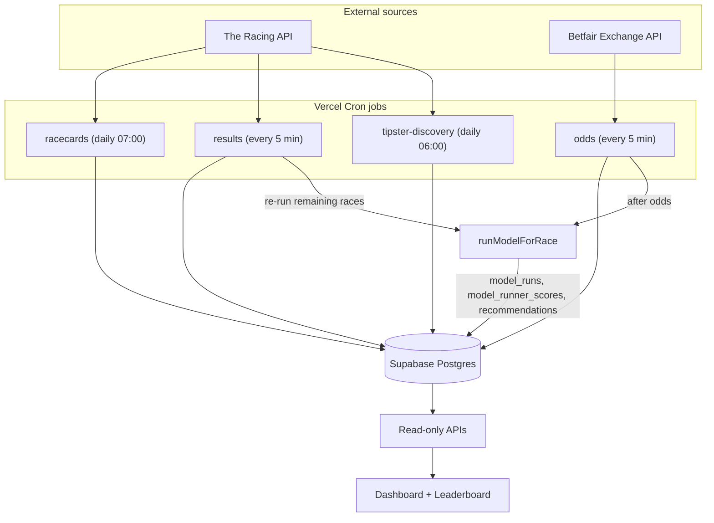

# ascott-race-bot

A Next.js + Supabase horse-racing **value model**. It ingests today's UK & Irish
races, prices the field from live market odds (optionally blended with
quality-weighted tipster signals), finds positive expected-value (+EV) bets,
sizes stakes with fractional Kelly, and persists the result to Postgres. A web
dashboard and JSON APIs read that persisted output.

> **Personal tool.** This is not a polished product, and it produces real
> staking guidance. Review the math, and add authentication before exposing any
> endpoint publicly.
>
> **No guarantees — responsible use.** This is a research / decision-support
> tool. It does **not** predict winners and makes **no guarantee of profit**,
> no "sure things", and no risk-free bets. All betting carries risk and you can
> lose money. Treat every output as one input to your own judgement, stake only
> what you can afford to lose, follow the laws in your jurisdiction, and seek
> support if gambling stops being fun (e.g. GamCare / BeGambleAware). See
> [docs/LOCAL_SETUP.md](docs/LOCAL_SETUP.md) and
> [docs/RACE_DAY_RUNBOOK.md](docs/RACE_DAY_RUNBOOK.md) to run it locally.
This project is intentionally a **decision-support system** and does not place
bets or support auto-betting. Control-plane writes are gated through explicit
operator commands, dry-run defaults, and `--commit` authorization.

For AI assistant guidance, use `CLAUDE.md` as the authoritative prompt and
workflow briefing document. See `docs/RACE_DAY_AUTOMATION_STATUS.md` for the
current safety posture and automation roadmap.
## Tech stack

- [Next.js 16](https://nextjs.org/) (App Router) + [React 19](https://react.dev/)
- TypeScript (path alias `@/*` → `src/*`)
- [Supabase](https://supabase.com/) (Postgres) via `@supabase/supabase-js`,
  using the **service-role key, server-side only**
- [Vercel Cron](https://vercel.com/docs/cron-jobs) for scheduled ingestion
- [tsx](https://github.com/privatenumber/tsx) for the standalone scripts and the
  custom test runner
- External data: [The Racing API](https://www.theracingapi.com) (paid,
  ToS-compliant) and the [Betfair Exchange API](https://developer.betfair.com/)

## How it works

The system is split into a **producer side** (cron jobs ingest data and write a
model run to the database) and a **reader side** (the dashboard and most APIs
only read what the producer persisted). Nothing in the web app recomputes the
model on the fly.



Two layers keep the pipeline testable:

- **[src/lib/raceSync.ts](src/lib/raceSync.ts)** — the **pure transform layer**:
  deterministic mapping + entity-matching (no I/O, no DB), unit-tested on
  fixtures. It never invents data — missing fields map to `null`/`undefined`.
- **[src/lib/liveSync.ts](src/lib/liveSync.ts)** — the **I/O orchestration
  layer**: fetches from The Racing API / Betfair, applies the transforms, and
  performs idempotent writes to `races` / `runners` / `market_snapshots` /
  `runner_quotes`, then triggers the model. Exposes `syncRacecards`,
  `syncOddsFromBetfair`, and `syncResults`.

## Project structure

```
src/
  app/
    layout.tsx                       # Root layout
    page.tsx                         # Recommendations dashboard (client page)
    how-it-works/page.tsx            # Static "how the model works" page
    leaderboard/page.tsx             # Tipster leaderboard (client page)
    api/
      recommendations/route.ts       # GET today's race cards (dashboard)
      recommend-bet/route.ts         # GET top pick for one race_id
      run-model/route.ts             # POST trigger a model run for a race
      settle/route.ts                # POST record a result + recompute accuracy
      accuracy/route.ts              # GET live strike rate / P&L / ROI
      tipsters/in-form/route.ts      # GET top active tipsters
      tipsters/leaderboard/route.ts  # GET all tracked tipsters
      cron/
        tipster-discovery/route.ts   # Daily: refresh tipster signals
        racecards/route.ts           # Daily: ingest today's cards
        odds/route.ts                # Every 5 min: ingest Betfair prices
        results/route.ts             # Every 5 min: settle + re-run model
        recommendations/route.ts     # DISABLED stub (returns 410)
  lib/
    supabaseAdmin.ts                 # Server-side Supabase client (service role)
    racingApi.ts                     # The Racing API adapter (cards, results, signals)
    betfairExchange.ts               # Betfair Exchange client (cert login + prices)
    raceSync.ts                      # Pure transforms + entity matching (no I/O)
    liveSync.ts                      # I/O orchestration for the cron pipeline
    runModelForRace.ts               # Model producer: scores a race + persists it
    bettingEngine.ts                 # EV, fractional Kelly, confidence score
    modelProbabilities.ts            # Tipster-weighted, anti-crowd win probabilities
    raceData.ts                      # Supabase data access (reads model output)
    recommendBet.ts                  # Reads the latest run's top recommendation
    discoverTipsters.ts              # Tipster "needle" scoring + promote/demote
    historicalRaceLoader.ts          # Validation core for the historical loader
    betfairBsp.ts                    # Betfair BSP CSV -> historical import
    backtestStats.ts                 # Backtest aggregation math
  components/                        # Presentational UI (model flow, explanation panel)
scripts/                            # CLI tools, simulations, backtests, tests
supabase/migrations/                # SQL migrations
data/                               # Example imports (historical races, tipster CSV)
docs/                               # Setup + runbook + design docs
vercel.json                         # Cron schedule
```

## The ingestion pipeline (cron jobs)

Four cron routes are scheduled in [vercel.json](vercel.json). Each is **idempotent**
and protected by an optional `CRON_SECRET` bearer token (Vercel Cron sends it).

| Route                          | Schedule        | What it does                                                                                   |
| ------------------------------ | --------------- | ---------------------------------------------------------------------------------------------- |
| `/api/cron/tipster-discovery`  | `0 6 * * *`     | Pull trainer/jockey performance from The Racing API, score tipster momentum, upsert tipsters.  |
| `/api/cron/racecards`          | `0 7 * * *`     | Pull today's UK & IRE racecards, upsert `races` (`scheduled`) + `runners`.                      |
| `/api/cron/odds`               | `*/5 * * * *`   | Poll Betfair Exchange for live prices, write `market_snapshots` + `runner_quotes`.             |
| `/api/cron/results`            | `*/5 * * * *`   | Settle results (finish pos + SP/BSP via `/v1/results`); on a Standard-plan block, falls back **today** to `/v1/results/today` then `/v1/results/today/free` (finish positions only, no SP/BSP), then **re-runs the model**. |

**Entity matching:** the `races` / `runners` tables hold no external provider id,
so API entities are matched back to DB rows on a normalised **(course + off-time)**
for the race and a normalised **horse name** for the runner. Unmatched entities
are **skipped**, never written to the wrong row.

## The model (producer)

[src/lib/runModelForRace.ts](src/lib/runModelForRace.ts) is the producer that
powers the read side. For one race it runs the TypeScript engine and **persists**
the result across three tables:

- `model_runs` — one row per run (run metadata + the `market_snapshots` anchor).
- `model_runner_scores` — per-runner probability / edge / EV / rank.
- `recommendations` — the run's recommended bet(s), keyed by `model_run_id`.

**Append-only model history.** A fresh run inserts new rows stamped
`is_current = true` (`superseded_at = null`), then **marks the race's prior
current rows superseded** (`is_current = false`, `superseded_at = now`) — an
UPDATE, never a DELETE. Historical runs are retained and remain queryable; the
read paths filter on `is_current = true`. Insert-first means a failed insert
never destroys existing output, and if the supersede step fails the readers
still pick the newest run by `run_time`. (supabase-js cannot wrap multiple
statements in one transaction, so this is best-effort rather than atomic — see
Caveats.)

The scoring pipeline:

1. **Probabilities** ([src/lib/modelProbabilities.ts](src/lib/modelProbabilities.ts)) —
   base probabilities are de-overrounded market-implied (`1/odds`, normalised)
   when every runner is priced, else an equal split. They are then adjusted by
   quality-weighted tipster support, an anti-crowd "hidden value" bias (rewards
   strong but lightly-tipped runners, penalises over-hyped favourites above 40%
   crowd share), and odds-band multipliers (prices `< 2.0` and `> 12.0` are
   faded). Normalised to sum to 1.
2. **EV** ([src/lib/bettingEngine.ts](src/lib/bettingEngine.ts)) — `EV = prob * odds - 1`.
3. **Confidence** — blends EV size, model-vs-market edge, and independent tipster
   agreement into a `[0, 1]` score with `high` / `medium` / `low` labels.
4. **Stake** — **fractional Kelly (0.2)** scaled by confidence and clamped to
   **0.1%–2%** of bankroll. Bankroll is read from the latest `bankroll_ledger`
   balance, falling back to `1000` when the ledger is empty.

Tipster quality weight = `0.5·ROI + 0.3·A/E + 0.2·strikeRate` (ROI and A/E
min-max normalised across the cohort scored in a run).

> The web app does **not** recompute any of this.
> [src/lib/recommendBet.ts](src/lib/recommendBet.ts) simply reads the latest
> run's rank-1 recommendation.

### Data quality, confidence adjustment & stake suppression

Each run also computes an **observational data-quality layer** from data it
actually has (never fabricated) and persists it alongside the run (in the
`data_quality_flags` column + a `config_json` snapshot):

- **Data-quality flags** — e.g. low market completeness, stale odds, missing
  runner prices, no/unmatched tipster selections. Each carries a severity and a
  human-readable summary.
- **Confidence adjustment** — the run's headline confidence is scaled down when
  data quality is weak (e.g. stale or incomplete odds). This is recorded for
  display; it does **not** change the probability math.
- **Stake suppression** — when data quality is insufficient, the selected bet's
  stake is zeroed while the selection itself is preserved. Ranking, probabilities,
  EV, and selection are untouched — only the stake is suppressed.
- **Tipster consensus & alignment** — how much tipster support each runner has,
  and whether that consensus agrees with the model's pick. Observational only.

These layers are **additive and observational**: they inform and annotate the
run but do not alter the core probability / EV / Kelly math above. They are
surfaced read-only through the API and dashboard (see Frontend).

## Tipster discovery

[src/lib/discoverTipsters.ts](src/lib/discoverTipsters.ts) turns **real, proofed**
leaderboard figures into a momentum ("needle") score and a model weight, then
auto-promotes/demotes tipsters in the active pool:

- `reliability = N / (N + 400)` (sample-size shrinkage)
- `needle_score = 0.45·z(longRunROI) + 0.35·z(recentROI_30d) + 0.20·z(streak)`
- `final_weight = reliability · exp(needle_score)`

[src/lib/racingApi.ts](src/lib/racingApi.ts) is the only implemented signal
source (it derives signals from real trainer/jockey analysis). The other
platform adapters in `discoverTipsters.ts` are deliberately **left
unimplemented** (they throw) so the integrity contract holds: a source must
return verbatim proofed figures or nothing — never a guess.

## Manual tipster CSV importer

Because the live pipeline does not populate `tipster_selections`, real tipster
picks are added with an **offline, operator-curated CSV importer**
([scripts/importTipsterSelections.ts](scripts/importTipsterSelections.ts),
`npm run import:tipster-selections`). It is deliberately conservative:

- **Dry-run by default.** It writes nothing unless `--commit` is passed, and it
  refuses `--commit` while any field still contains placeholder `EXAMPLE` text.
- **Never fabricates.** A pick is stored only when its race **and** runner
  resolve unambiguously — race by normalised (course + off-time), runner by
  exact normalised horse name. Unmatched/ambiguous rows are **skipped and
  reported**, never guessed; an unresolved tipster name is kept verbatim with
  `tipster_id = null`.
- **Idempotent.** Inserts upsert with `ignoreDuplicates` on
  `(race_id, runner_id, raw_tipster_name)`, so re-importing the same pick never
  double-counts it.
- **Read-only diagnostics.** `--list-races [--date YYYY-MM-DD] [--course <name>]`
  prints candidate races; the dry-run shows available runners for unmatched
  horses, nearby races for unmatched races, and a "Fix your CSV" section.
- **`source_label` rollback.** Each row carries the `source_label` you set, so a
  bad batch is cleanly removable:
  `delete from public.tipster_selections where source_label = '<your-label>';`
  (preview with a `select count(*)` first).

CSV columns: `meeting_date,course,off_time,horse_name,tipster_name` (required) +
`raw_affiliation,source_label` (optional). Template:
[data/tipster-selections.example.csv](data/tipster-selections.example.csv). Run
the model **after** importing (or re-run it) so the consensus reflects the new
picks. For local testing without live data, `npm run seed:demo -- --confirm-demo`
seeds a clearly-synthetic race. Full walkthrough:
[docs/RACE_DAY_RUNBOOK.md](docs/RACE_DAY_RUNBOOK.md).

## API

All routes are read-only unless noted. Errors are logged server-side; client
responses avoid leaking internal detail.

| Route                                         | Method | Purpose                                                            |
| --------------------------------------------- | ------ | ------------------------------------------------------------------ |
| `/api/recommendations`                        | GET    | One rich race card per today's race, sorted by off-time.           |
| `/api/recommend-bet?race_id=<id>`             | GET    | The latest run's top (`rank` 1) recommendation for one race.       |
| `/api/run-model?race_id=<id>`                 | POST   | **Writes.** Trigger a model run for a race over HTTP.              |
| `/api/settle?race_id=&winning_runner_id=`     | POST   | **Writes.** Record a winner, then recompute live accuracy.        |
| `/api/accuracy`                               | GET    | Live strike rate / level-stakes P&L / ROI across settled races.    |
| `/api/tipsters/in-form?limit=<n>`             | GET    | Top active tipsters by needle weight (+ today's picks).            |
| `/api/tipsters/leaderboard`                   | GET    | Every tracked tipster (active + demoted).                          |

`/api/recommend-bet` returns `RaceRecommendation`
(`{ race_id, runner_id, horse_name, rank, odds, model_prob, market_prob, ev,
confidence_label, confidence_score, stake_pct, stake_amount }`): `200` with the
pick, `400` when `race_id` is missing, `404` when the race has no run yet, `500`
on failure.

> **Obsolete:** `/api/cron/recommendations` is a **disabled stub** that returns
> HTTP `410 Gone`. It used to recompute recommendations in TypeScript and upsert
> them; the model now produces them upstream. Its cron entry has been removed
> from [vercel.json](vercel.json).

## Frontend

- **[/](src/app/page.tsx)** — recommendations dashboard: one card per race with a
  live countdown, the market favourite, the model's rank-1 pick (with a "Why"
  rationale and stake), 1–2 alternatives, a live accuracy tracker, and a
  **Model explanation** panel that surfaces the run's data-quality + tipster
  observability read-only (data-quality / stake-suppression / confidence /
  consensus). It renders a safe empty state when a race has no usable
  observability.
- **[/how-it-works](src/app/how-it-works/page.tsx)** — a static, plain-language
  explanation of how the model works (data → analysis → data-quality →
  confidence + safeguards → recommendation), with a responsible-positioning note.
- **[/leaderboard](src/app/leaderboard/page.tsx)** — sortable tipster leaderboard;
  active vs. demoted rows, signed ROI, and a reliability bar.

The pages are client components with inline styles (no UI library) and poll the
read APIs for updates; `/how-it-works` is static.

## Database schema

Table and column names are centralised as constants at the top of
[src/lib/raceData.ts](src/lib/raceData.ts) (verified against the live schema).

- **Core:** `races`, `runners`, `market_snapshots`, `runner_quotes`,
  `model_runs`, `model_runner_scores`, `recommendations`, `bankroll_ledger`.
- **Tipsters:** `tipsters`, `tipster_aliases`, `tipster_priors`,
  `tipster_review_queue`, `tipster_selections`, `tipster_source_registry`,
  `tipster_selection_candidates`, `tipster_discovery_runs`,
  `tipster_discovery_candidates`, `tipster_dynamic_weights`.

Schema details worth knowing:

- `runner_quotes` has **no** `race_id`/timestamp of its own — odds hang off the
  parent `market_snapshots` row (`snapshot_id`). "Latest odds" means the newest
  snapshot for the race, taking the best decimal price per runner within it.
- `recommendations` is keyed by `model_run_id` (not by `race_id`).
- `tipster_selections` is created by
  [supabase/migrations/20260612000000_create_tipster_selections.sql](supabase/migrations/20260612000000_create_tipster_selections.sql).
  The live cron pipeline does not populate it, so live model runs are
  **market-only** unless selections are supplied via the **manual CSV importer**
  (below). `runModelForRace` handles empty tipster data gracefully.

> **Fresh-schema requirement.** The repo migrations only *ALTER* the model
> tables and *create* `tipster_selections`; they do **not** contain
> `CREATE TABLE` for the base tables (`races`, `runners`, `market_snapshots`,
> `runner_quotes`, `model_runs`, `model_runner_scores`, `recommendations`,
> `bankroll_ledger`, `tipsters`, `tipster_aliases`, `tipster_priors`,
> `tipster_review_queue`). After a **fresh Supabase reset**, those base tables
> must already exist. Verify what is present with the **read-only**
> `npm run check:db` (it probes each required table/column, prints a PASS/FAIL
> summary, and emits read-only SQL to confirm indexes + RLS).

## Getting started

### Prerequisites

- Node.js >= 20.9.0 (see `engines` in [package.json](package.json))
- A **Supabase** project. After a fresh reset, ensure the base tables exist and
  verify with `npm run check:db` (see the fresh-schema note under Database
  schema).
- **The Racing API** credentials — needed for racecards, results, and tipster
  discovery.
- **Betfair** credentials — needed only for the live odds pipeline. Betfair uses
  cert-based login and its **certificate setup is currently a manual step**; you
  can run everything else (racecards, model runs, the tipster importer, the
  dashboard, `/how-it-works`) without it.

> See [docs/LOCAL_SETUP.md](docs/LOCAL_SETUP.md) for the full local setup and
> [docs/RACE_DAY_RUNBOOK.md](docs/RACE_DAY_RUNBOOK.md) for the race-day runbook.

### Install

```bash
npm install
```

### Configure environment

Copy the example file and fill in your values:

```bash
cp .env.example .env
```

| Variable                    | Required for          | Description                                                              |
| --------------------------- | --------------------- | ------------------------------------------------------------------------ |
| `SUPABASE_URL`              | everything            | Supabase project URL.                                                     |
| `SUPABASE_SERVICE_ROLE_KEY` | everything            | Service-role secret key. **Server-side only — bypasses RLS.**            |
| `CRON_SECRET`               | cron auth             | Bearer secret the cron routes require when set.                          |
| `RACING_API_USER`           | racecards / results / tipsters | The Racing API HTTP Basic username.                             |
| `RACING_API_KEY`            | racecards / results / tipsters | The Racing API HTTP Basic password.                             |
| `BETFAIR_APP_KEY`           | odds                  | Betfair application key.                                                  |
| `BETFAIR_USERNAME`          | odds                  | Betfair account username.                                                |
| `BETFAIR_PASSWORD`          | odds                  | Betfair account password.                                                |
| `BETFAIR_CERT_PEM`          | odds                  | Betfair client certificate PEM (literal `\n` allowed).                   |
| `BETFAIR_KEY_PEM`           | odds                  | Betfair client private key PEM (literal `\n` allowed).                   |
| `DEBUG_MODEL`               | optional              | Set to `1` to emit model trace logs.                                      |

All credentials are validated **lazily, at request time**, so importing a module
never throws and `next build` can statically analyse the routes. Check which
variables are set with `npm run check:env` (prints names + present/missing only —
never values).

### Run

```bash
npm run dev
```

Then open http://localhost:3000.

## Scripts

| Script                    | Purpose                                                              |
| ------------------------- | -------------------------------------------------------------------- |
| `npm run dev`             | Start the dev server.                                                |
| `npm run build`           | Production build.                                                    |
| `npm run start`           | Run the production build.                                            |
| `npm run lint`            | Lint with ESLint (`eslint .`).                                       |
| `npm run typecheck`       | Type-check with `tsc --noEmit`.                                      |
| `npm run format`          | Format with Prettier.                                                |
| `npm run format:check`    | Verify formatting without writing.                                  |
| `npm test`                | Run the custom test runner ([scripts/tests.ts](scripts/tests.ts)).  |
| `npm run run:model`       | Run the model for a race from the CLI.                              |
| `npm run backtest`        | Backtest the model over settled/historical races.                  |
| `npm run simulate`        | Royal Ascot simulation.                                            |
| `npm run simulate:novalue`| No-value simulation.                                               |
| `npm run seed:tipsters`   | Seed in-form tipsters.                                             |
| `npm run load:races`      | Load a historical-races import (see [data/](data/)).               |
| `npm run convert:bsp`     | Convert a Betfair BSP CSV into a historical import.                |
| `npm run verify:racing`   | Smoke-check The Racing API integration.                            |
| `npm run verify:ingestion`| Verify pipeline ingestion.                                         |
| `npm run inspect:schema`  | Inspect the live database schema.                                  |
| `npm run check:env`       | Read-only: report which env vars are set (names only, no values).  |
| `npm run check:db`        | Read-only: verify required tables/columns exist (PASS/FAIL).       |
| `npm run import:tipster-selections` | Manual tipster-selection CSV importer (dry-run by default). |
| `npm run seed:demo`       | Insert a clearly-synthetic local demo race (`--confirm-demo`).     |

## Deployment

Designed for Vercel. The cron schedules in [vercel.json](vercel.json) include
sub-daily jobs (every 5 minutes), which require a plan that supports them. Set
all environment variables above in every environment.

## Design principles

- **Never fabricate data.** Every persisted value traces to an API response;
  missing data is stored as `null`/omitted and unmatched entities are skipped —
  nothing is invented, estimated, or interpolated.
- **Idempotent ingestion.** Re-running any cron job in the same day reuses
  existing rows rather than duplicating them.
- **Pure core, I/O shell.** Transforms and math (`raceSync`, `modelProbabilities`,
  `bettingEngine`, `backtestStats`, `historicalRaceLoader`, `betfairBsp`) are
  side-effect-free and unit-tested on fixtures; DB orchestration stays thin.
- **Producer / reader split.** The model writes to the database; the web app
  reads it.
- **Service role is server-only.** `supabaseAdmin` bypasses RLS and must only be
  imported in server-side code (route handlers, scripts).

## Caveats & TODOs

- **Live runs are market-only.** Until `tipster_selections` is populated for a
  race (via the manual CSV importer), the model scores from market odds alone
  (no tipster weighting).
- **Same-day results settle automatically; SP/BSP + non-today need more.** When
  `/v1/results` (Standard plan) is plan-blocked, `results:auto` and
  `/api/cron/results` settle **today's** finishing positions via
  `/v1/results/today` (Basic) → `/v1/results/today/free` (Free) — no SP/BSP (left
  null, never fabricated). Use `results:auto --commit` only on a clean dry-run
  audit; use the manual CSV importer (`import:results`) for SP/BSP, non-today
  dates, or when the today endpoints are unavailable.
- **`/api/recommend-bet` has no auth.** Add authentication before exposing it,
  since it reads staking logic backed by service-role data access.
  `POST /api/run-model` and the cron routes are gated by `CRON_SECRET` when it
  is set (open in local/dev when unset).
- **Model writes are not atomic.** supabase-js can't run a multi-statement
  transaction, so `runModelForRace` uses a best-effort insert-then-supersede
  order (append-only history; older rows are UPDATED, not deleted). For strict
  atomicity, move the logic into a Postgres function called via
  `supabaseAdmin.rpc(...)`.
- **Fresh-schema baseline.** The repo migrations do not create the base tables;
  a freshly-reset Supabase project must already have them (see Database schema).
  Run `npm run check:db` to verify.
- Some platform tipster-source adapters in `discoverTipsters.ts` are intentional
  unimplemented stubs and throw until real, ToS-compliant fetch/parse logic is
  supplied.

## Security notes

- `supabaseAdmin` uses the service-role key and **bypasses Row Level Security**.
  Only import it in server-side code.
- The cron endpoints require `CRON_SECRET` when it is set. Set it in every
  environment.
- Add authentication to the non-cron mutating/reading endpoints before exposing
  them publicly (see Caveats).
