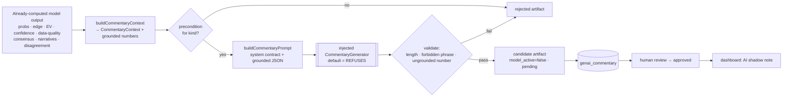

# GenAI Shadow Commentary (Phase 4G)

**Status:** core implemented (grounding, prompts, guardrails, storage, tests).
The live LLM call is intentionally **off** (injected generator; default refuses).
**Mandate:** shadow-only, decision-support, informational. It explains
already-computed model output in plain English for a human reviewer and can
**never** affect the model or become betting logic.

---

## 0. The five invariants

| Invariant | How it's guaranteed |
| --- | --- |
| Never affects model scores | It only *reads* model output; nothing it writes is read back by the model. No probability/EV/stake/rank/selection is ever produced. |
| Never becomes betting logic | Guardrails reject betting verbs, predictions, and ungrounded numbers (§4). |
| Remains informational | Every artifact is `model_active = false` (CHECK-enforced in DB) + `review_status = 'pending'`. |
| Off by default | The LLM is an injected `CommentaryGenerator`; the default `unconfiguredCommentaryGenerator()` throws. |
| Auditable | Each artifact stores `prompt_version`, generator name/version, guardrail `problems`, and the exact `grounding` it was allowed to use. |

---

## 1. Architecture

The pipeline is **grounding → prompt → generate → validate → store → review →
surface**. Generation never touches the model; the model never reads
`genai_commentary`. The boundary is one-directional by construction. Core lives
in [src/lib/genaiShadowCommentary.ts](../src/lib/genaiShadowCommentary.ts) (pure
except the injected generator).

It complements the existing **structured** shadow layer
([noteFeatureExtraction.ts](../src/lib/noteFeatureExtraction.ts), notes →
features); this one is **narrative** (model output → prose).

---

## 2. Prompt framework

Versioned (`PROMPT_VERSION = genai-commentary-v1`,
[prompts/genai-race-commentary.md](../prompts/genai-race-commentary.md)). Each of
the five kinds shares one **system contract** (grounding-only, no prediction, no
betting advice, preserve uncertainty, untrusted text, length budget, mandatory
disclaimer) and a **task line**:

| Kind | Task | Precondition |
| --- | --- | --- |
| `race_summary` | model pick vs favourite, agreement, headline context | always |
| `trainer_note` | restate trainer-form evidence only | trainer narrative present |
| `narrative_risk` | restate caution narratives as confidence risks | ≥1 caution narrative |
| `confidence_commentary` | explain the computed run-quality / confidence | run-quality / label present |
| `disagreement_reason` | why model ≠ market, from edge/probability/narrative | real disagreement (`agree=false`) |

The **user message** is the `CommentaryContext` JSON (the only facts allowed) +
the instruction to end with `(AI shadow note — not betting advice.)`.
`buildCommentaryPrompt` is pure — it builds the text, it does **not** call a model.

---

## 3. Storage approach

Migration
[20260618020000_genai_commentary.sql](../supabase/migrations/20260618020000_genai_commentary.sql)
adds **one additive table** `genai_commentary`, isolated from the model's tables:

- `kind`, `commentary_text` (NULL when rejected), `status`
  (`candidate`|`rejected`), `problems` (jsonb), `grounding` (jsonb snapshot).
- Provenance: `race_id`, `model_run_id`, `prompt_version`, `generator_name`,
  `generator_version`, `generated_at`.
- **DB-level shadow guard:** `model_active boolean NOT NULL DEFAULT false CHECK
  (model_active = false)` — a model-active row is *physically un-insertable*.
- Review gate: `review_status` (`pending`|`approved`|`rejected`), `reviewed_at`,
  `review_notes`; index `(review_status, status)` so the dashboard reads only
  approved candidates. `check:db` updated.

Storing the `grounding` snapshot means any surfaced note can be diffed against
exactly the facts it was permitted to use — full anti-fabrication provenance.

---

## 4. Guardrails

Pure, in [genaiShadowCommentary.ts](../src/lib/genaiShadowCommentary.ts), applied
to every generation before it can become a candidate:

1. **Anti-fabrication number check** — `groundedNumbersFromContext` derives the
   allowed numeric tokens *entirely from the structured context*;
   `findUngroundedNumbers` rejects any number in the prose not in that set. The
   model literally cannot introduce a figure.
2. **Forbidden phrases** — `findForbiddenPhrases` rejects betting verbs
   (`back this`, `lay this`, `bet on`, `stake`, `wager`, `each-way bet`, `nap`,
   `banker`) and predictions / overconfidence (`will win`, `can't lose`,
   `guaranteed`, `sure thing`, `nailed on`).
3. **Length budget** per kind (cost + scope).
4. **Preconditions** — a kind can't be generated without its supporting facts
   (e.g. `disagreement_reason` needs a real disagreement), so the model is never
   asked to write about nothing.
5. **Containment** — a generator error or any failure yields a `rejected`
   artifact (`text: null` + problems), never an exception that reaches the model
   path and never an unsafe note.
6. **Off-switch** — default generator refuses; enabling requires explicitly
   injecting a configured one. **Kill switch** = stop injecting it.
7. **DB CHECK** — `model_active = false` enforced in Postgres (defence in depth).
8. **Human review** — `pending` until approved; only approved notes surface.

Also inherits the repo's **untrusted-input** posture: free text in the context is
data, never instructions (prompt-injection aware), and the licence/copyright
policy in [raceIntelligenceSources.ts](../src/lib/raceIntelligenceSources.ts)
still governs any note-derived input.

---

## 5. Dashboard integration

Surfaced through the existing decision-support seam, clearly fenced:

- A read-only **"AI commentary (shadow)"** card under the model-explanation panel,
  reading **only** `genai_commentary` rows with `review_status='approved'` AND
  `status='candidate'` for the race, each rendered with its `kind` label, the
  prose, and a persistent **"AI shadow note — not betting advice"** disclaimer +
  generator/prompt provenance on hover.
- It sits **beside** [RaceExplanationPanel](../src/components/RaceExplanationPanel.tsx)
  / [RaceIntelligencePanel](../src/lib/raceIntelligence.ts), never replacing the
  computed explanation. Empty/unreviewed → the card simply doesn't render.
- A small **review view** (operator) lists `pending` candidates with their
  `grounding` and `problems` to approve/reject — mirroring the note-review plan
  ([GENAI_NOTE_REVIEW_UI_PLAN.md](./GENAI_NOTE_REVIEW_UI_PLAN.md)).

No dashboard wiring is shipped yet because the generator is off (nothing to show);
the read path is a thin additive API once a reviewed generator is configured.

---

## 6. Files

| File | Role |
| --- | --- |
| [src/lib/genaiShadowCommentary.ts](../src/lib/genaiShadowCommentary.ts) | Pure context/prompt/guardrails + injected generator + orchestrator |
| [scripts/genaiShadowCommentary.test.ts](../scripts/genaiShadowCommentary.test.ts) | 10 guardrail tests (grounding, forbidden, preconditions, shadow invariants) |
| [prompts/genai-race-commentary.md](../prompts/genai-race-commentary.md) | Versioned prompt framework |
| [supabase/migrations/20260618020000_genai_commentary.sql](../supabase/migrations/20260618020000_genai_commentary.sql) | Additive shadow store (model_active CHECK) |

**Out of scope (by mandate):** any change to model probability, EV, staking,
ranking, recommendations; any live API call until a generator is explicitly
configured and reviewed; any scraped/unlicensed source content.
