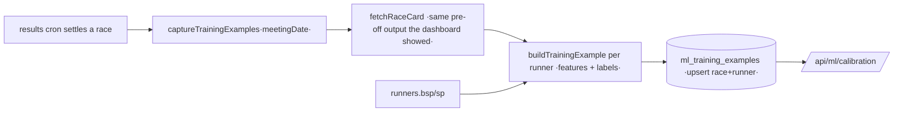

# ML Learning Pipeline (Phase 6 — shadow)

**Status:** implemented — self-building capture store, calibration + feature-
importance engines, automatic capture in the results cron, and a read-only
reporting API.
**Mandate:** keep the production model untouched; all ML runs in **shadow**. This
layer captures outcomes and computes diagnostics; it **never** changes
probability, EV, staking, ranking, or any recommendation, and nothing it produces
is read back by the model.

---

## 0. What it captures (every race outcome)

Per `(race, runner)`, once settled: **recommendation**, **model probability**,
**EV**, **odds**, **race result** (finish/won), **placed result**, **favourite
result**, and **confidence score** — exactly the tracked fields, plus market
probability, edge, field size, and BSP/SP (labels).

---

## 1. Data model

[mlTrainingExample.ts](../src/lib/mlTrainingExample.ts) — `TrainingExample`, built
by the pure `buildTrainingExample(...)`. **Leakage-segregated** by construction:

| Group | Fields |
| --- | --- |
| **FEATURE_FIELDS** (pre-off-known) | `recommended`, `recommendation_rank`, `model_prob`, `market_prob`, `edge`, `ev`, `odds`, `confidence_score`, `confidence_label`, `is_favourite`, `field_size` |
| **LABEL_FIELDS** (post-race) | `finish_pos`, `won`, `placed`, `favourite_won`, `favourite_placed`, `bsp_decimal`, `sp_decimal` |

`won`/`placed` derive from `finish_pos` via the shared
[deriveWon/derivePlaced](../src/lib/trainingExport.ts) (null until settled — never
fabricated). The two field sets are disjoint (a test enforces it), so a trainer
can never feed an outcome back as an input. BSP is a label only.

---

## 2. Storage architecture

Migration
[20260618040000_ml_training_examples.sql](../supabase/migrations/20260618040000_ml_training_examples.sql)
— one **additive, append-only** table `ml_training_examples`, isolated from the
model's decision tables:

- **Unique** `(race_id, runner_id)` → idempotent capture (re-runs refresh, never
  duplicate); index on `meeting_date` for windowed reads.
- Provenance: `model_run_id`, `model_version`, `captured_at`.
- It is **never** read by the production model — purely a shadow dataset for
  experimentation/calibration/importance. `check:db` updated.

This complements the existing manual CSV
[export:training-data](../src/lib/trainingExport.ts): the table builds itself
continuously and adds the **recommendation + favourite** flags the CSV omits,
while the CSV remains for portable, offline ML.

---

## 3. Training dataset design

[mlCapture.ts](../src/lib/mlCapture.ts) reuses `fetchRaceCard` so each captured
example is exactly the as-of-off-time model output (no re-derivation drift),
joins settle prices, and upserts. Only **settled races with a model run** are
captured. Per-race failures are isolated.

---

## 4. Evaluation process

Pure, model-free, fully tested:

- **Model calibration** ([mlCalibration.ts](../src/lib/mlCalibration.ts)):
  `calibrateBinary(model_prob → won)` → Brier, log loss, **ECE**, **MCE**, the
  reliability diagram, and predicted-vs-observed means. A `sufficientSample` flag
  guards against reading too much into < 100 settled examples.
- **Confidence calibration:** `calibrateConfidence(confidence_score → won)` by
  low/medium/high band — does "high confidence" actually win more?
- **Feature importance** ([featureImportance.ts](../src/lib/featureImportance.ts)):
  per-feature **win-rate lift across quantile bins** + **point-biserial
  correlation** with the outcome, ranked, with an explicit insufficient-sample
  guard. *Association, not causation* — a research aid, never a promotion gate.
- These align with the existing offline
  [mlShadowEvaluation](../src/lib/mlShadowEvaluation.ts) + the promotion
  discipline in [MODEL_CHANGE_CHECKLIST.md](./MODEL_CHANGE_CHECKLIST.md) (promote
  only on improved calibration/ROI, out-of-sample, leakage-free).

---

## 5. Learning loop

1. **Capture (automatic):** every 5 min the results cron settles races and calls
   `captureTrainingExamples` (best-effort — never blocks settlement), so the
   dataset grows itself.
2. **Evaluate (shadow):** `GET /api/ml/calibration` (or the offline `ml:evaluate`
   CSV path) computes calibration + importance over a window.
3. **Experiment (offline):** train candidate models on the captured features →
   labels; compare against the market-only + current-rules baselines.
4. **Gate:** a candidate is considered only if it beats the baseline on
   **calibration AND ROI**, out-of-sample, leakage-free — the existing rule.
5. **Promote (separate, explicit, never here):** any future activation goes
   through the same validated, ramped, audited path as the other engines —
   `model_active` stays false until a human decides. The production model is
   untouched by this phase.

---

## 6. Dashboard reporting

Read-only [GET /api/ml/calibration](../src/app/api/ml/calibration/route.ts)
(`?from=&to=`, default last 30 days) returns:

- `summary`: recommendation win rate, favourite win rate, sample size.
- `modelCalibration`: Brier / log loss / ECE / MCE + the reliability diagram
  (render as a calibration curve: predicted vs observed per bin).
- `confidenceCalibration`: a low/medium/high band table (bar per band).
- `featureImportance`: a ranked bar of correlation/lift per feature.

It is pure-read and safe to poll. A dashboard "Model learning (shadow)" panel
renders these beside the existing reports, clearly labelled shadow.

---

## 7. Files

| File | Role |
| --- | --- |
| [src/lib/mlTrainingExample.ts](../src/lib/mlTrainingExample.ts) | Data model + builder (+5 tests) |
| [src/lib/mlCalibration.ts](../src/lib/mlCalibration.ts) | Model + confidence calibration (+7 tests) |
| [src/lib/featureImportance.ts](../src/lib/featureImportance.ts) | Explainable importance (+5 tests) |
| [src/lib/mlCapture.ts](../src/lib/mlCapture.ts) | Automatic capture (reuses `fetchRaceCard`) |
| [src/app/api/ml/calibration/route.ts](../src/app/api/ml/calibration/route.ts) | Read-only reporting API |
| [supabase/migrations/20260618040000_ml_training_examples.sql](../supabase/migrations/20260618040000_ml_training_examples.sql) | Append-only capture store |
| results cron · dbHealthSpec | Capture wiring + schema check |

**Out of scope (by mandate):** any change to model probability / EV / staking /
ranking; any live ML activation (everything is `model_active`-false shadow until
a separate, validated, human decision).
