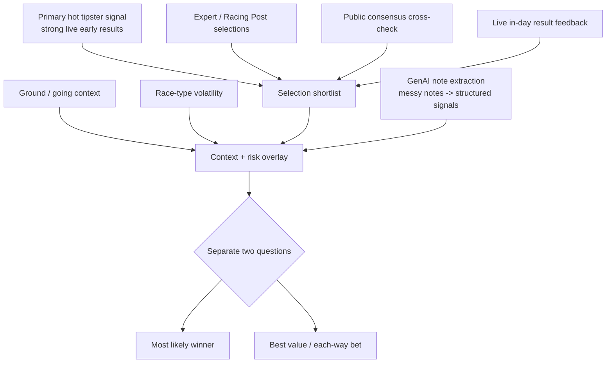

# Model Improvement Build Plan

> **Status: PLANNING / RESEARCH ONLY. Not approved for production.**
>
> This is a forward-looking build plan for improving how Ascott Race Bot reasons
> about a race. It contains **no runtime code, no model-math/staking/ranking
> changes, and no migrations** — it is a design document only.
>
> Ascott Race Bot is a personal **research / decision-support tool**. Nothing
> here is a winner predictor, a profit guarantee, or a "sure thing". Every signal
> described below is intended to make the model's reasoning **more explainable and
> more testable** — not to promise accuracy. All betting involves risk.
>
> **GenAI in this plan is strictly a structured feature-extraction and
> reasoning-audit layer. It never predicts winners and never invents facts.**

---

## Prior Successful-Day Process — Lessons To Build Into The Model

On a prior successful day, the process that worked was **not** "follow one
tipster" and **not** "blindly trust one data model". It was a **hybrid,
human-in-the-loop process** that combined several independent signals and,
crucially, separated *most likely winner* from *best value bet*. The goal of this
plan is to turn those lessons into **structured, auditable, testable** signals —
without overfitting to a single good day and without ever claiming guaranteed
results.

What the prior process actually combined:

1. A **primary tipster** whose live early results were strong **on that day**.
2. **Racing Post / expert selections** as a secondary validation layer.
3. **Public consensus** as a cross-check (not a driver).
4. **Early live race results** as a "today's read" signal.
5. **Ground / going conditions**.
6. **Race-type volatility / risk**.
7. Explicit separation of **"most likely winner" vs "best value bet"**.
8. **Each-way / value signals** for volatile races.
9. **Avoiding overconfidence** in chaotic races.
10. **GenAI-style structuring** of messy race notes into comparable signals.

> **Caution (anti-overfitting).** One good day is one data point. The lessons
> below become **experimental, capped, decaying, backtested** signals — never
> hard-coded certainties. The plan's default posture is scepticism: a signal is
> assumed worthless until evaluation shows otherwise on out-of-sample data.

---

## 1. Problem statement

Today's model frequently produces **LOW confidence**, and that is honest: it is
mostly working from a thin set of inputs —

- market odds (implied probability),
- approved tipster selections (often none → market-only),
- data-quality flags,
- simple consensus / edge signals.

What it currently **lacks** is deeper **contextual reasoning** that experienced
form students use:

- ground / going suitability,
- pace setup,
- draw bias,
- trip (distance) suitability,
- trainer (and jockey) form,
- class moves,
- race-type volatility,
- and **live in-day tipster form**.

Because those signals are missing, **LOW confidence** today usually means
**insufficient or conflicting evidence** — **not automatically a bad bet or a good
one**. The improvements below aim to make confidence **decompose into reasons** and
to add contextual evidence — while keeping every new input **non-model-active until
it is proven**.

---

## 2. Successful prior-day pattern

The hybrid process, described as a pipeline of independent cross-checks:



Key properties to preserve:

- **No single source dominates.** The tipster is a signal, not an instruction.
- **Live feedback is used cautiously**, as a "today's read", not as proof.
- **Value and likely-winner are different questions** and are answered
  separately.
- **Volatile races invite caution** (each-way thinking, smaller conviction),
  never bigger stakes.
- **GenAI turns prose into comparable fields** so signals can be weighed instead
  of "felt".

---

## 3. New feature group: structured contextual signals

Proposed **pre-race** features, stored per runner. Every signal is tri-state
(`positive` / `negative` / `unknown`) unless noted, and **`unknown` is the
default** — missing or ambiguous evidence must never be coerced into a positive or
negative.

| Feature | Values |
| --- | --- |
| `ground_signal` | positive / negative / unknown |
| `distance_signal` | positive / negative / unknown |
| `course_form_signal` | positive / negative / unknown |
| `draw_signal` | positive / negative / unknown |
| `pace_setup_signal` | positive / negative / unknown |
| `trainer_form_signal` | positive / negative / unknown |
| `jockey_signal` | positive / negative / unknown |
| `recent_run_signal` | positive / negative / unknown |
| `class_move_signal` | positive / negative / unknown |
| `market_support_signal` | positive / negative / unknown |
| `race_type_risk` | low / medium / high |
| `volatility_risk` | low / medium / high |
| `value_case_strength` | none / weak / medium / strong |
| `likely_winner_case_strength` | none / weak / medium / strong |
| `each_way_case_strength` | none / weak / medium / strong |
| `concern_flags` | list of short tags (e.g. `wide_draw`, `volatile_handicap`) |
| `evidence_quote_or_reference` | the note/quote each signal was derived from |
| `extraction_confidence` | 0–1 (how clearly the evidence supported the signal) |

Rules:

- **Each non-`unknown` signal must carry evidence** (a quote or reference).
- **No fabrication.** If a note does not address ground, `ground_signal` stays
  `unknown` — it is not guessed from odds or anything else.
- These are **descriptive features for evaluation first**, not automatic
  probability inputs.

---

## 4. New feature group: in-day tipster form

A deliberately **cautious, experimental** signal capturing "is this tipster
running hot *today*?" — inspired by the prior day (e.g. a tipster with two early
winners, including value / each-way winners, raising confidence in their later
picks **for that day only**).

Design guardrails:

- Track whether a tipster's **earlier same-day** picks **won / placed / lost**.
- Feed it **only into the `tipster_confidence` component at first** — **never**
  directly into win probability.
- **Decay and cap heavily.** Two results is a tiny sample; the effect must be
  small, decay over the day, and be hard-capped so it can never swing a decision
  on its own.
- Keep it an **experimental diagnostic** (visible, logged) until backtested.
- **Never let one hot tipster override** market pricing, data-quality warnings, or
  contextual concerns.
- **Correlation groups**: tipsters who routinely copy each other (or share a
  source) must be grouped so related "winners" are not **double-counted** as
  independent confirmation.
- Explicitly guard against **chasing one good day**: in-day form resets daily and
  is treated as weak evidence, not a trend.

---

## 5. GenAI extraction pipeline

GenAI's role is **feature extraction and reasoning audit only**. It converts
messy, **manually-gathered or public/legal** notes into structured, comparable
fields. It does **not** pick winners, and it does **not** invent missing facts.

```text
Manual / public / legal race notes
   → source document record (raw text + provenance + retrieval date)
   → GenAI extraction (note text → candidate structured features + evidence)
   → structured JSON features (tri-state signals + evidence + extraction_confidence)
   → human / review gate (operator confirms or rejects each feature)
   → stored as NON-model-active features
   → backtest (do these features improve calibration / ROI without added drawdown?)
   → feature flag (per-feature, off by default)
   → only then model-active (and even then, confidence before probability)
```

What GenAI did in the successful process (and what it should do here):

- Converted prose into comparable signals, e.g.
  - "should relish the ground" → `ground_signal = positive`
  - "step up in trip suits" → `distance_signal = positive`
  - "draw could be tricky" → `draw_signal = negative`
  - "trainer in great form" → `trainer_form_signal = positive`
  - "strong pace setup" → `pace_setup_signal = positive`
- Improved **selection filtering**, helped **explain why a horse might be value**,
  separated **market luck from genuine contextual support**, **reduced noise**
  from raw tipster consensus, and made the reasoning **auditable and testable**.

Hard constraints:

- **GenAI extracts features only — never predicts the winner.**
- **GenAI never invents missing facts.** Ambiguous or absent → `unknown`.
- **Every extracted feature needs evidence** (a quote or reference).
- Keep the **raw source reference** and a **feature/extraction version** so any
  output can be re-audited.
- Sources must be **manual, public, or properly licensed** — never scraped from
  private, paywalled, logged-in, or ToS-restricted places.

---

## 6. Confidence model improvements

Split the single confidence number into **named components**, so "LOW" explains
*why* rather than just being low:

- `data_confidence` — completeness / freshness of market + runner data.
- `market_confidence` — how informative / liquid the price signal is.
- `tipster_confidence` — approved tipster support (and, experimentally, in-day
  form).
- `contextual_confidence` — strength of structured contextual signals (§3).
- `race_type_confidence` — inverse of race-type / volatility risk.
- `extraction_confidence` — how well-evidenced the note-derived features are.
- `execution_confidence` — practical confidence the shown price is actionable
  (indicative only — this tool never places bets).
- `overall_confidence` — a transparent combination of the above.

A LOW `overall_confidence` should map to a concrete reason, e.g.:

- missing odds,
- volatile race,
- divergent tipsters,
- weak contextual support,
- high uncertainty,
- incomplete source evidence,
- many runners with similar EV (no separation).

This is an **explainability** improvement; it does not change the probability or
staking math.

---

## 7. Evaluation framework

Adopt a **pre-registered GO / NO-GO** discipline. No contextual feature or in-day
signal becomes model-active until it clears the bar on **out-of-sample, pre-race
known** data.

Compare three arms:

1. **Market-only baseline** (the control to beat),
2. **Current model**,
3. **Model + contextual features** (and, separately, + in-day tipster form).

Rules:

- **Historical races only**, using **only features known before the off**.
- **No leakage** — post-race information (finishing position, BSP, in-running)
  must never enter a pre-race feature.
- **Evaluate as-of off time.** Score each race on its **latest model run with
  `run_time <= off_time`** — the final pre-off run. Post-off reruns (stale odds,
  often no bet) are **diagnostic only** and must never replace the race-day
  decision record. This mirrors the production fix described below.
- Metrics:
  - strike rate,
  - ROI,
  - Brier score,
  - log loss,
  - calibration by confidence band,
  - CLV / BSP comparison,
  - max drawdown,
  - performance by odds band,
  - performance by race type,
  - performance when model and tipsters **align**,
  - performance when model and GenAI-context **align**,
  - performance when tipsters are **divergent**.
- **Promotion rule:** a feature is promoted **only** if it improves calibration
  and/or ROI **without** increasing drawdown unacceptably. "Better-looking notes"
  is **not** evidence; only the metrics are.

> **Evaluation integrity — the 2026-06-16 incident.** During Royal Ascot Day 1
> the pipeline kept running after off times; post-off stale runs (no positive-EV
> bet) superseded the valid pre-off runs in `is_current`, so the dashboard showed
> **0/4 winners, settled 4, 3 no-bet** when the honest pre-off record was
> **0/7**. Append-only history had preserved every true pre-off run, so the fix
> was evaluation-only: select `run_time <= off_time`, plus a producer guard that
> skips post-off / resulted runs (or writes them **non-current**). No model math,
> staking, ranking, or historical rows were changed. Lesson for every signal in
> this plan: **evaluate on the pre-off decision record only** — the same
> no-leakage discipline applied to run selection — and remember this remains
> **decision-support, not a betting guarantee.**

### 7.1 Current automation status (implemented)

The evaluation discipline above is **already live** in the tool. These are
evaluation / observability changes only — they do **not** change model math,
staking, or ranking:

- **As-of-off-time (pre-off) evaluation** is implemented: the dashboard and
  performance metrics score each race on its **latest model run with
  `run_time <= off_time`** (the final pre-off run).
- **Post-off / resulted run guards** are implemented: the producer skips post-off
  or resulted races (or writes such runs **non-current**), so stale reruns can
  never supersede the pre-off decision record.
- **Historical race cards use the final pre-off run**, not a later post-off
  `is_current` rerun.
- A **read-only pre-off snapshot generator** exists for spot-checking a meeting:

  ```bash
  npm run snapshot:pre-off -- --date YYYY-MM-DD --course COURSE
  ```

  It reads stored model runs and writes a snapshot report; it places no bets and
  changes no model math, staking, or ranking.

### 7.2 Next automation target — read-only end-of-day report

The next automation step is a **read-only end-of-day report generator**:

```bash
npm run report:day -- --date YYYY-MM-DD --course COURSE
```

For each race it would join the **final pre-off model run**, the **official
result** and **finishing position**, **P/L**, and the recorded
**confidence / data-quality / tipster state**, then summarise the day's
**patterns**. Like the snapshot generator it is **read-only** — no model-math,
staking, ranking, or row changes — and exists to make each day **auditable**, not
to predict.

### 7.3 Future no-bet / skip-gate research (backtest-gated)

Conditions worth researching as **no-bet / skip gates** — all of them
**experimental and forbidden from activation until backtested** on out-of-sample,
pre-off data (§7):

- **LOW** confidence **+ DIVERGENT** tipsters **+ DEGRADED** data quality.
- **LOW** confidence **+ NO_TIPSTER_CONSENSUS** in a large field.
- **stale odds** or **post-off** model runs.
- **many runners with similar EV** (no separation between candidates).
- **missing runner odds** beyond a threshold.
- **high volatility** combined with **weak contextual evidence**.

These are research hypotheses for the evaluation framework, not approved rules.
**No gate may suppress a bet in production until it clears the GO / NO-GO bar.**

### 7.4 Manual notes vs the official model record

Manual race-day notes and hand-built snapshots are **useful** for sense-checking,
but they are **not** the official record. Official evaluation always uses the
**latest stored `model_run` where `run_time <= off_time`** (the final pre-off DB
run):

- If a **user snapshot differs** from the final pre-off DB run, **record both** —
  keep the note, but do not overwrite the stored run.
- **Performance is computed from the final pre-off DB run**, never from the manual
  note.

This keeps the decision record consistent with the as-of-off-time discipline
above and prevents after-the-fact notes from re-scoring a settled day.

---

## 8. Database / schema ideas (future, additive only)

**Planning only — no migrations now.** All future tables would be **additive**;
no destructive changes, no edits to existing tables in this plan.

- `source_documents` — raw notes + provenance + retrieval date.
- `extracted_note_features` — per-runner structured signals + evidence.
- `feature_extraction_runs` — which extraction/version produced which features.
- `contextual_runner_features` — the curated, review-gated feature set.
- `in_day_tipster_form` — per-tipster same-day result tracking (experimental).
- `confidence_components` — the decomposed confidence values per run.
- `model_experiment_runs` — experiment definitions (arms, date splits, flags).
- `model_experiment_results` — metrics per experiment for GO / NO-GO review.

These mirror the project's existing pattern: capture first, **non-model-active**,
review-gated, and only promoted after evaluation.

---

## 9. Implementation phases

A phased roadmap that adds **observation before influence** and **influence on
confidence before probability**:

- **Phase A — Logging only.** Record pre-race snapshots, model pick, tipster
  state, data quality, result, and notes. **No new model influence.**
- **Phase B — Manual contextual tagging.** Manually tag
  ground / draw / pace / trip / race-type signals after reading notes. Store
  **outside** the model.
- **Phase C — GenAI extraction prototype.** GenAI converts notes into structured
  JSON; a human reviews. **Not model-active.**
- **Phase D — Backtest.** Compare feature-tagged vs untagged selections; evaluate
  against the market-only baseline (§7).
- **Phase E — Confidence dashboard.** Surface the separate confidence components
  (§6). Read-only explainability.
- **Phase F — Feature-flag experiment.** Allow contextual features to affect
  **confidence first, not probability**. Only affect probability after strong,
  backtested evidence.
- **Phase G — Production promotion.** Promote only proven signals. Keep a **kill
  switch** and **audit logs**; revert instantly if live calibration degrades.

---

## 10. Things NOT to do

- **Do not chase one successful day.** One good day is not a trend.
- **Do not increase stakes because of a short hot streak.** Staking math is not
  changed by sentiment.
- **Do not let GenAI choose winners.** It extracts features only.
- **Do not scrape** private, paywalled, logged-in, or ToS-restricted sources.
- **Do not let in-day tipster form dominate** the model or override pricing /
  data-quality warnings.
- **Do not mix post-race info into pre-race training features** (leakage).
- **Do not call better notes "accuracy"** until it is backtested. Clearer
  reasoning is not the same as being right.

---

## 11. Concrete JSON example

An example of one runner's extracted, **non-model-active**, review-pending
contextual feature record. Note `model_active: false` and `review_status:
pending` — nothing here influences the model until reviewed, backtested, and
flagged on.

```json
{
  "race_id": "example",
  "runner_name": "Example Horse",
  "source_document_id": "example",
  "ground_signal": "positive",
  "distance_signal": "positive",
  "course_form_signal": "unknown",
  "draw_signal": "negative",
  "pace_setup_signal": "positive",
  "trainer_form_signal": "positive",
  "jockey_signal": "unknown",
  "recent_run_signal": "positive",
  "class_move_signal": "unknown",
  "race_type_risk": "high",
  "volatility_risk": "high",
  "value_case_strength": "medium",
  "likely_winner_case_strength": "weak",
  "each_way_case_strength": "strong",
  "concern_flags": ["wide_draw", "volatile_handicap"],
  "evidence": [
    {
      "feature": "ground_signal",
      "quote_or_reference": "Tipster note says the horse should relish soft ground"
    }
  ],
  "extraction_confidence": 0.78,
  "model_active": false,
  "review_status": "pending"
}
```

---

## 12. Relationship to the rest of the project

- This plan is **complementary to**, not a replacement for, the existing
  rules / market-based model and the
  [Neural Network Extension plan](ML_NEURAL_NETWORK_PLAN.md). The production model
  stays rules / market-based until any extension clears its evaluation gate.
- It reuses the project's established safety pattern: **capture →
  non-model-active → human review → backtest → feature flag → promote**, with a
  kill switch and audit logs.
- It changes **no** model probability math, staking, ranking, API routes,
  scripts, migrations, or tests. Those would each be separate, explicitly-approved
  pieces of work **after** evaluation, not part of this document.
