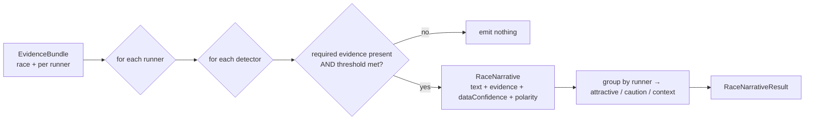

# Race Narrative Intelligence (Phase 4F)

**Status:** engine implemented + tested. Evidence assembly (ingestion) is the
integration plan below.
**Mandate:** decision-support only. It turns quantitative evidence into short,
**factual, evidence-gated** narratives that explain *why a horse is attractive*
and *why confidence is reduced*. It changes **no** model value (probability, EV,
staking, selection, ranking, recommendation).

**Integrity contract (the whole point):** a narrative is emitted **only** when
its required evidence is present **and** clears a minimum sample/threshold.
Missing or thin evidence yields **nothing** — never a guess. Every emitted
narrative carries its numbers in `evidence`, so no claim is unsupported.

---

## 1. Feature catalogue

Each feature is a pure detector in
[raceNarrativeIntelligence.ts](../src/lib/raceNarrativeIntelligence.ts) with a
**polarity** — ATTRACTIVE (a reason to like), CAUTION (a reason to reduce
confidence), or CONTEXT (neutral framing).

| Feature | Polarity | Trigger (evidence-gated) | Required evidence |
| --- | --- | --- | --- |
| `trainer_form` | ATTRACTIVE / CAUTION | strike ≥ 20% (hot) / ≤ 6% (cold), runs ≥ 5 | trainer windowed runs+wins+strike |
| `jockey_upgrade` | ATTRACTIVE | today's rider strike − previous ≥ 6%, both runs ≥ 5 | today + previous jockey strike |
| `class_drop` | ATTRACTIVE | today's class number > last (lower grade) | race class + horse's last class |
| `class_rise` | CONTEXT / CAUTION | today's class < last (CAUTION if lightly raced) | race class + last class (+ career runs) |
| `draw_advantage` | ATTRACTIVE | draw in the favoured band | draw + field size + sample-backed `drawBias` |
| `draw_disadvantage` | CAUTION | draw in the opposite extreme | draw + field size + `drawBias` |
| `ground_suitability` | ATTRACTIVE / CAUTION | win-rate ≥ 20% on the going / 0 wins+places, runs ≥ 3 | horse's record on today's going |
| `course_suitability` | ATTRACTIVE | ≥ 1 course win, or ≥ 2 course places | horse's course record |
| `festival_profile` | ATTRACTIVE | ≥ 1 festival win, runs ≥ 3, today is a festival | festival flag + festival record |
| `pace_setup` | ATTRACTIVE / CAUTION | lone leader / ≥ 3 front-runners vs run-style | field front-runner count + run style |
| `unexposed` | CAUTION | ≤ 3 career runs | career run count |

Thresholds are exported constants (`HOT_STRIKE`, `MIN_CONNECTION_RUNS`,
`SUITED_WIN_RATE`, …) so tuning is one edit and the tests stay in sync.

---

## 2. Narrative generation logic

- [buildRaceNarratives(race, runners)](../src/lib/raceNarrativeIntelligence.ts)
  runs all detectors over each runner, keeps only emitted narratives, and groups
  them per runner by polarity.
- Each `RaceNarrative` carries `evidence` (the supporting numbers) and a
  `dataConfidence ∈ [0,1]` derived from the sample size behind it
  (`N/(N+K)`) — so a claim from 6 runs is visibly weaker than one from 60.
- [summariseRunnerNarratives](../src/lib/raceNarrativeIntelligence.ts) condenses a
  runner into two lists: **attractive** (why to like) and **caution** (why
  confidence is reduced) — the exact strings the dashboard + model-explanation
  panel render.

**No unsupported claims, three ways:** (1) detectors return `null` without their
inputs; (2) minimum-sample gates reject thin evidence; (3) the numbers are
embedded in the text *and* in `evidence` for audit.

---

## 3. Data requirements

The engine is generic over an **EvidenceBundle**; the table maps each input to
its real source and current availability.

| Evidence | Source | Stored today? |
| --- | --- | --- |
| field size, draw, official rating, weight, finish history | `runners` (stored) | ✅ yes |
| handicap flag, course, meeting date | `races` (stored) | ✅ yes |
| trainer / jockey windowed form | The Racing API analysis (already wired in [racingApi.ts](../src/lib/racingApi.ts) `fetchRacingApiSignals`) | ⚠️ fetched, not persisted per-runner |
| race **class / pattern / going / distance** | The Racing API `/racecards/standard` (`StandardRacecard`) | ❌ dropped at sync (not in `races`) |
| horse **last-run class**, going/course/festival **records**, **career runs** | The Racing API horse results / a history table | ❌ not stored |
| **run style** / front-runner count (pace) | run-style data (Racing API / form) or operator notes | ❌ not stored |
| **draw bias** per course/distance/going | a bias reference table or ingested operator notes | ❌ not stored |
| going / pace / bias commentary | ingested operator notes ([raceIntelligenceSources.ts](../src/lib/raceIntelligenceSources.ts), already scaffolded) | ⚠️ qualitative only |

**Honest conclusion:** with today's schema only a few features can fire
(draw — *once a bias reference exists* — and `unexposed`/context). The rest need
the additive ingestion in §4. The engine is built so each unlocks the moment its
evidence is supplied — nothing fabricated in the meantime.

---

## 4. Integration plan (tiered, additive)

**Tier A — now (stored fields).** Assemble an EvidenceBundle from `races` +
`runners`; emit the few supported features. Surface via the existing
decision-support seam (below). Zero schema change.

**Tier B — additive ingestion (unlocks most features).**
1. **Persist racecard attributes** the API already returns but we drop: add
   nullable `races` columns `race_class`, `pattern`, `going`, `distance_f` (+ per-
   runner `draw` if not present) in an additive migration; populate in
   [liveSync.ts](../src/lib/liveSync.ts) `syncRacecards`. → unlocks class moves,
   ground/pace context.
2. **Persist connection form** snapshots from `fetchRacingApiSignals` keyed by
   trainer/jockey → unlocks `trainer_form`, `jockey_upgrade`.
3. **Add a `horse_form` history** (last class, going/course/festival records,
   career runs) from the API → unlocks suitability + class history.
4. **Draw-bias reference** (course/distance/going → favoured band + sample) as a
   small reference table or computed from stored results → unlocks draw features.

**Tier C — operator notes / GenAI (qualitative).** The ingested race-intelligence
notes (going/pace/bias topics) already exist; a future GenAI extraction step can
emit the same `RaceNarrative` shape with `evidence = { source_ref }`, so notes and
computed narratives render identically.

**Surfacing (all tiers).** Narratives attach to the race card as decision-support
and flow through the **same observability/explanation path** the consensus engine
uses — `config_json` → `getModelObservabilityFromConfig` →
`deriveRaceExplanationProps` →
[RaceExplanationPanel](../src/components/RaceExplanationPanel.tsx) — and into the
[Race Intelligence panel](../src/lib/raceIntelligence.ts). They **support model
explanations** (the "why" lists) but never feed probability/EV/staking. Any future
*influence* on the model must go through a validated, ramped, backtested gate
(as documented for dynamic weighting), never silently here.

---

## 5. Dashboard examples

Per-runner, rendered from `summariseRunnerNarratives`:

> **Galloping Major** — *why attractive*
> • Trainer in strong recent form — 9 from 30 (30%) over 14d
> • Drop in class — from Class 2 to Class 4
> • Proven on the ground — 2 wins from 6 on Soft
> • Draw advantage — stall 2 of 12 sits in the favoured low group
>
> *why confidence is reduced*
> • Lightly raced — only 2 career runs; form is less exposed

> **Front Runner Filly** — *why confidence is reduced*
> • Pace setup — 4 front-runners; a strong early pace may compromise prominent types
> • Draw disadvantage — stall 12 of 12 is on the unfavoured high side

Empty state (the common case until Tier B lands), shown honestly:

> *No evidence-backed narrative for this runner yet.*

Each bullet is a verbatim detector output with its numbers, so the operator can
trust it — and anything without evidence simply does not appear.

---

## 6. Files

| File | Role |
| --- | --- |
| [src/lib/raceNarrativeIntelligence.ts](../src/lib/raceNarrativeIntelligence.ts) | Pure engine: evidence types, 11 detectors, generator, summariser |
| [scripts/raceNarrativeIntelligence.test.ts](../scripts/raceNarrativeIntelligence.test.ts) | 10 tests (evidence-gating + every feature) |

**Out of scope (by mandate):** any change to model probability, EV, staking,
ranking, recommendations, or auto-activation; and any scraped/unlicensed content
(operator notes follow the existing licence/copyright policy).
