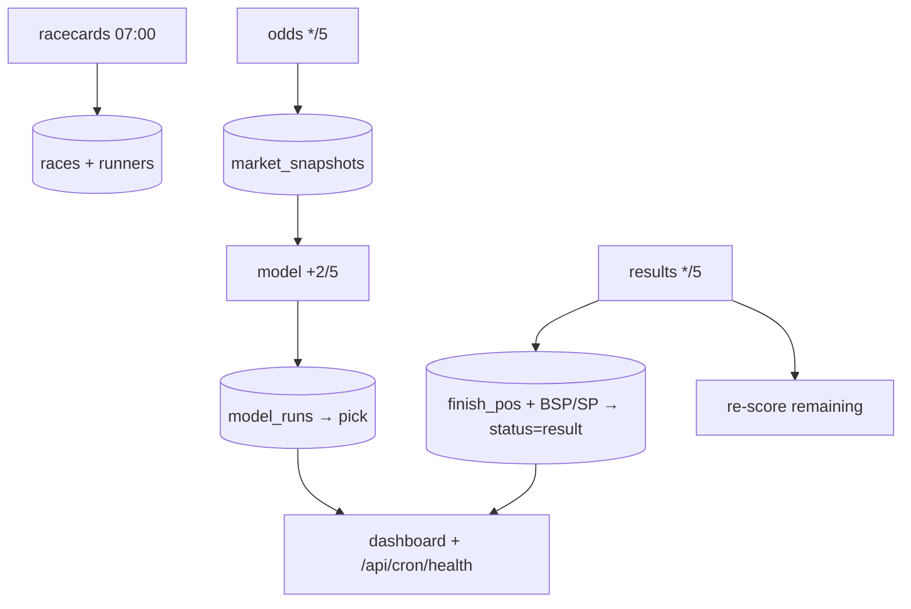

# Self-Updating Race-Day System (Phase 5)

**Status:** implemented — decoupled model cron, cron heartbeat, health engine +
read-API, and best-effort run logging across every cron.
**Mandate:** decision-support only. The system refreshes data and re-scores the
model automatically; it **never places a bet** and contains no auto-betting.

---

## 0. What changed vs "manual"

Cards/odds/results crons already existed. This phase makes the loop **self-healing
and observable**: model refresh is **decoupled** from settlement, every cron emits
a **heartbeat**, and a **health engine + endpoint** turns freshness into a verdict
and an operator action.

---

## 1. Cron schedule (`vercel.json`)

| Job | Path | Schedule | Purpose |
| --- | --- | --- | --- |
| Tipster discovery | `/api/cron/tipster-discovery` | `0 6 * * *` | daily proofed-form refresh |
| Racecards | `/api/cron/racecards` | `0 7 * * *` | pull the day's cards + runners |
| Odds | `/api/cron/odds` | `*/5 * * * *` | Betfair snapshot every 5 min |
| **Model** | **`/api/cron/model`** | **`2-59/5 * * * *`** | **re-score unsettled races (NEW; offset +2m from odds)** |
| Results | `/api/cron/results` | `*/5 * * * *` | detect results → settle → re-score |

The **+2-minute offset** means the model cron scores the snapshot the odds cron
just wrote. All crons are idempotent and authenticated by the optional
`CRON_SECRET` bearer.

---

## 2. Refresh strategy

- **Racecards:** once, pre-racing. Idempotent upsert (course+off_time); never
  downgrades an existing race.
- **Odds:** every 5 min; append-only snapshots (the model reads the latest), so a
  re-run never double-writes.
- **Model:** every 5 min, **independent of results** via
  `refreshModelForMeeting(meetingDate)` — market-only, per-race isolated, supersedes
  the prior current run (history is append-only). *Decoupling is the key fix:* a
  results-feed outage no longer freezes the model.
- **Results:** every 5 min; detect → write `finish_pos`/BSP/SP → `status='result'`
  → re-score the rest. Idempotent.

---

## 3. Error recovery

- **Idempotent + self-healing:** every job is safe to re-run, so the *next* 5-min
  tick is the primary recovery — a transient failure heals itself.
- **Isolation:** per-race model failures are caught and counted; one bad race
  never sinks the batch. A cron failure is contained to that job (the others keep
  running) — and model refresh no longer depends on results succeeding.
- **Diagnostics:** each route wraps errors with `buildCronErrorDiagnostic`
  (secret-safe message + a static hint, e.g. "check RACING_API_* / plan").
- **Heartbeat:** every run records a `cron_runs` row (ok/failed, duration, counts,
  error message) — **best-effort** (`recordCronRun` never throws), so monitoring
  can't break a cron.
- **Backfill:** `?date=YYYY-MM-DD` / `?day=tomorrow` on every job re-runs a
  specific day; the manual `pipeline:day --commit` remains the operator override.
- **Settlement fallback:** if `/v1/results` is plan-blocked, the operator path
  (`results:auto` → `import:results --commit`) still settles; the health engine
  raises **"Settlement overdue"** so it's noticed.

---

## 4. Monitoring

- **`cron_runs` heartbeat** ([cronHeartbeat.ts](../src/lib/cronHeartbeat.ts)):
  `buildCronRunRecord` shapes each run; `summarizeCronHealth` reduces recent rows
  to per-job **last-OK / last-FAIL** signals.
- **Health engine** ([raceDayHealth.ts](../src/lib/raceDayHealth.ts), pure +
  tested): per-stage freshness (`FRESH`/`STALE`/`STALLED`/`IDLE`/`PENDING`) with
  explicit thresholds (odds/model STALE > 12m, STALLED > 20m; model "lagging" if
  > 10m behind odds; settlement overdue > 25m, stalled > 45m), an overall
  `HEALTHY`/`DEGRADED`/`STALLED`/`IDLE`, and the single operator action.
  Missing signals during racing are **STALLED, never FRESH** — a dead cron is
  surfaced, not hidden.
- **Phase-aware:** stages are only held to cadence during the racing window, so
  there are no false alarms pre/post racing.

---

## 5. Health dashboards

- **`GET /api/cron/health`** ([route](../src/app/api/cron/health/route.ts)) —
  read-only; gathers the meeting's races + latest odds/model times + recent
  heartbeats and returns the full `RaceDayHealth` (per-stage status, system
  status, operator action, counts) + `cronJobs`. This backs:
  - the **dashboard freshness indicators** (the existing `FreshnessRow` /
    `liveStatus` widgets can render `systemStatus` + per-stage chips), and
  - any **external uptime monitor** (poll it; alert on `STALLED`).
- The endpoint is pure-read and safe to hit continuously. The existing
  read-only `dashboardReadiness` / `operatorNextAction` widgets remain the
  pre-flight + per-race companions.

---

## 6. Race-day operator workflow (self-updating)

The operator **supervises**, they don't drive:

1. **Pre-racing:** confirm cards loaded (`/api/cron/health` → racecards FRESH);
   `npm run check:env` / `check:db` green. Optionally `capture:t-minus`.
2. **During racing (hands-off):** the crons refresh odds, re-score the model, and
   detect/settle results every 5 min. Watch the **health panel**: `HEALTHY` =
   monitor only.
3. **On an alert** (`DEGRADED`/`STALLED`): follow the action text —
   - *Odds stalled* → check Betfair creds / odds cron.
   - *Model stalled* → check the model cron (now independent of results).
   - *Settlement overdue* → results cron, or `results:auto` →
     `import:results --commit`.
4. **Post-racing:** all settled → `report:day`, `confidence:audit`, `gates:audit`,
   `export:training-data`.

**No auto-betting** anywhere: the system produces data, scores, and commentary for
a human; it never stakes. The live-betting freeze policy
([RACE_DAY_AUTOMATION_STATUS.md](./RACE_DAY_AUTOMATION_STATUS.md)) is unchanged.

---

## 7. Files

| File | Role |
| --- | --- |
| [src/lib/raceDayHealth.ts](../src/lib/raceDayHealth.ts) | Pure health/freshness engine (+ 9 tests) |
| [src/lib/cronHeartbeat.ts](../src/lib/cronHeartbeat.ts) | Heartbeat shaper + summary + best-effort recorder (+ 4 tests) |
| [src/lib/liveSync.ts](../src/lib/liveSync.ts) | `refreshModelForMeeting` (decoupled model refresh) |
| [src/app/api/cron/model/route.ts](../src/app/api/cron/model/route.ts) | NEW model-refresh cron |
| [src/app/api/cron/health/route.ts](../src/app/api/cron/health/route.ts) | NEW read-only health endpoint |
| [supabase/migrations/20260618030000_cron_runs.sql](../supabase/migrations/20260618030000_cron_runs.sql) | `cron_runs` heartbeat table |
| `vercel.json` · racecards/odds/results/tipster-discovery routes | Schedule + heartbeat wiring |

**Out of scope (by mandate):** auto-betting, auto-staking, any change to model
probability / EV / staking / ranking maths.
