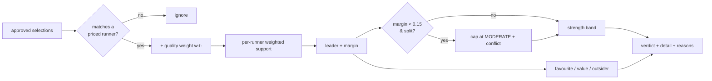

# Tipster Consensus Engine (Phase 4E)

**Status:** implemented (engine, persistence, dashboard surfacing, tests).
**Mandate:** decision-support only. It scores how strongly the (quality-weighted)
approved tipsters agree, classifies the consensus runner (favourite / value /
outsider), and surfaces an explainable verdict. It **does not** change model
probability, EV, staking, selection, ranking, or any recommendation.

---

## 0. Why this exists

The old observational consensus ([modelTipsterConsensus.ts](../src/lib/modelTipsterConsensus.ts))
is **unweighted** and only emits `NO_TIPSTER_CONSENSUS` vs a single leader — so a
race with a few approved selections shows little. This engine adds
**quality-weighted agreement**, four **strength bands**, **conflict handling**,
and **three consensus types**, producing lines like:

> **Consensus: Strong** — 7 of 9 weighted tipsters support *Galloping Major*
> **Consensus: Weak** — 3 of 12 weighted tipsters support *Some Outsider*

---

## 1. Consensus algorithm

[buildConsensusEngineResult(runners, selections, options)](../src/lib/tipsterConsensusEngine.ts):

1. **Match & weight.** For each selection whose `runner_id` is a known priced
   runner, add the tipster's **quality weight** `w(t)` to that runner (a tipster
   counts once per runner; unmatched selections are ignored, never attributed).
   `w(t)` comes from `tipsterQualityWeight({roi, strike_rate})` ∈ (0,1], neutral
   0.5 for unknowns — the same proofed stats already loaded for the run.
2. **Aggregate.** Per runner: `backers` (distinct tipsters) and
   `weighted_support = Σ w(t)`. `total_weighted = Σ` over the field;
   `total_tipsters` = distinct tipsters with a matched selection.
3. **Leader & margin.** Consensus runner = max `weighted_support` (ties → more
   backers → shorter odds → field order). `weighted_share = leader /
   total_weighted`; `margin = leader.share − runnerUp.share`.
4. **Conflict.** If >1 runner is backed and `margin < 0.15`, set `conflict` and
   **cap the band at MODERATE** (the field is split).
5. **Strength band** (see §2).
6. **Type** (favourite / value / outsider — see §2), using the leader's odds +
   model edge (both already on the scored field). Dimensions without data are
   reported `null`, never guessed.



---

## 2. Score formula

Let `s = weighted_share`, `b = backers`, `m = margin`.

**Strength bands** ([classifyStrength](../src/lib/tipsterConsensusEngine.ts)):

| Band | Condition |
| --- | --- |
| **NONE** | `b = 0` (no matched selections) |
| **STRONG** | `s ≥ 0.60` **and** `b ≥ 3` **and** `m ≥ 0.25` **and** not conflicted |
| **MODERATE** | `s ≥ 0.45` **and** `b ≥ 2` |
| **WEAK** | otherwise (≥1 backer) |

The minimum-backers gates stop "1 of 1 = 100%" reading as Strong. A continuous
score (for the ML feature) is

$$\text{strength\_score}= \Bigl[\,0.60\,s + 0.25\,\mathrm{clamp}_{01}\!\tfrac{m}{0.25} + 0.15\,\mathrm{clamp}_{01}\!\tfrac{b}{3}\Bigr]\times(\text{conflict}?\,0.85:1)$$

**Consensus type** (precedence; surfaces the most decision-relevant signal):

| Type | Rule |
| --- | --- |
| **VALUE** | leader model edge `(model_prob − market_prob) ≥ 0.03` (model + tipsters agree it's underpriced) |
| **FAVOURITE** | else, leader is the market favourite (shortest odds) |
| **OUTSIDER** | else, leader odds `≥ 8.0` (a longshot) |
| **MID** | else |

`is_market_favourite`, `is_outsider`, and `consensus_edge` are also reported for
transparency. The two dashboard examples are locked as tests.

---

## 3. Database updates

Consensus already persists in **`model_runs.config_json`** (the established
"Option A — no new columns" pattern), read back by
[getModelObservabilityFromConfig](../src/lib/modelRunConfigReaders.ts). This phase
adds **one additive jsonb key** — no migration, no schema churn, no risk to the
betting read-path:

```jsonc
// model_runs.config_json  (added key)
"tipster_consensus_engine": {
  "strength": "STRONG", "strength_score": 0.82, "type": "VALUE",
  "consensus_runner_id": "…", "supporters": 7, "total_tipsters": 9,
  "weighted_supporters": 6.1, "total_weighted": 7.4, "weighted_share": 0.82,
  "margin": 0.62, "conflict": false,
  "is_market_favourite": false, "is_outsider": false, "consensus_edge": 0.08,
  "runner_support": [ … ], "headline": "Strong",
  "detail": "7 of 9 weighted tipsters support Galloping Major",
  "reasons": [ … ]
}
```

Keeping it in `config_json` means the consensus is **immutably tied to the run
that produced it** (the same odds + selections), which a side table could drift
from. `check:db` is unaffected (no new table/column). A queryable analytics
column/table remains an optional future step if cross-run SQL is needed.

---

## 4. Dashboard UX

The engine output flows **run → `config_json` → `getModelObservabilityFromConfig`
→ `card.observability` → `deriveRaceExplanationProps` →
[RaceExplanationPanel](../src/components/RaceExplanationPanel.tsx)** (page.tsx
already spreads these props — no dashboard-logic change).

Rendered:
- A **badge**: `Consensus: Strong (value)` — colour-cued by band.
- A **detail line**: `7 of 9 weighted tipsters support <horse>` (real horse name,
  resolved at build time from the priced field).

Suggested follow-up (additive, documented): a per-card chip in the existing
warning-chip row toned by band (Strong=green, Moderate=blue, Weak=amber,
None=grey), and a small per-runner support bar in the field list. The data is
already on `observability.tipsterConsensusEngine.runner_support`.

---

## 5. Model feature integration

The verdict is **recorded as a model feature, observationally** — consistent with
the repo's contract that consensus "does NOT feed probabilities, confidence,
staking, selection, or ranking":

- **Persisted** per run in `config_json.tipster_consensus_engine` (above), so
  every run carries its consensus strength/type/score.
- **Exposed** via `ModelRunObservability.tipsterConsensusEngine` for dashboards,
  audits, and the ML training export.
- **Training export (next, additive):** emit `consensus_strength` (ordinal),
  `consensus_strength_score` (0..1), `consensus_type`, and `weighted_share` as
  **pre-race FEATURE columns** in [trainingExport.ts](../src/lib/trainingExport.ts)
  (they are pre-off-known, so leakage-safe), pairing with the existing
  `weighted_tipster_support` idea in [ML_NEURAL_NETWORK_PLAN.md](./ML_NEURAL_NETWORK_PLAN.md).
- **Future live use (gated):** should backtesting show consensus strength adds
  calibration/ROI, it can feed the model **only** through the same validated,
  ramped path described for dynamic weighting
  ([TIPSTER_DYNAMIC_WEIGHTING.md](./TIPSTER_DYNAMIC_WEIGHTING.md) §4) — never by
  silently altering staking here.

---

## 6. Files

| File | Role |
| --- | --- |
| [src/lib/tipsterConsensusEngine.ts](../src/lib/tipsterConsensusEngine.ts) | Pure engine: weighting, strength bands, conflict, type, display line |
| [scripts/tipsterConsensusEngine.test.ts](../scripts/tipsterConsensusEngine.test.ts) | 12 tests (incl. both dashboard examples) |
| [src/lib/runModelForRace.ts](../src/lib/runModelForRace.ts) | Computes + persists `tipster_consensus_engine` (observational) |
| [src/lib/modelRunConfigReaders.ts](../src/lib/modelRunConfigReaders.ts) | `getConsensusEngineFromConfig` + observability field |
| [src/lib/raceExplanation.ts](../src/lib/raceExplanation.ts) + [RaceExplanationPanel.tsx](../src/components/RaceExplanationPanel.tsx) | Dashboard props + render |

**Out of scope (by mandate):** any change to model probability, EV, staking,
ranking, recommendations, or auto-activation.
