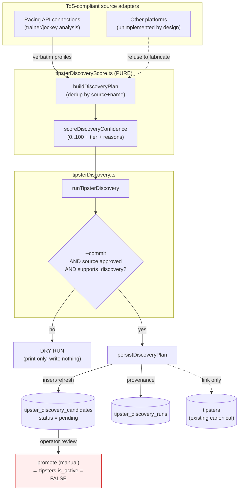

# Tipster Discovery Engine (Phase 4C)

**Status:** foundation implemented (capture + scoring + review tables). Source
adapters beyond The Racing API remain deliberately unimplemented.

**Mandate:** decision-support only. The engine **discovers** publicly available
racing tipsters and **captures** them into review tables. It never bets, never
feeds the model, never changes staking, and **never makes a tipster
model-active**. Promotion to the canonical pool is an explicit operator step,
and even then the tipster is created **inactive**.

---

## 1. Architecture

The engine is a thin, testable pipeline layered on the existing Phase 4A/4B
tipster-intelligence foundation. It reuses the source allow-list
(`tipster_source_registry`), the canonical-resolution logic
(`resolveCanonicalTipster`), and the alias model — and adds a **profile-level**
review queue alongside the existing **pick-level** one.



**Hard safety boundaries (enforced in code):**

| Boundary | Where enforced |
| --- | --- |
| Writes only `tipster_discovery_runs` + `tipster_discovery_candidates` | [persistDiscoveryPlan](../src/lib/tipsterDiscovery.ts) |
| Captured rows are always `status: 'pending'` | [toDiscoveryCandidateRow](../src/lib/tipsterDiscoveryScore.ts) (typed literal) |
| Never sets `is_active`, never writes `tipster_priors` / `tipster_selections` | engine touches none of those tables |
| Never fabricates a metric (missing → `null`) | pure scorer copies only published figures |
| Writes gated on a registered + approved + discovery-enabled source | CLI approval gate in [discoverTipsterProfiles.ts](../scripts/discoverTipsterProfiles.ts) |
| Status/decision never reverted by a re-run | refresh path omits `status`/`reviewed_at`/`review_notes` |

**Why a new profile queue (not the existing pick queue):**
`tipster_selection_candidates` holds **one pick** (a horse in a race);
`tipster_priors` holds metrics for **already-canonical** tipsters. Neither can
hold "a *newly discovered tipster* and their track record, awaiting review", so
`tipster_discovery_candidates` fills that gap additively.

---

## 2. Database changes (additive, `IF NOT EXISTS`)

Migration: [supabase/migrations/20260618000000_tipster_discovery_engine.sql](../supabase/migrations/20260618000000_tipster_discovery_engine.sql).

- **`tipster_source_registry`** — two additive columns:
  - `supports_discovery boolean not null default false` — opt-in: only crawled
    when **true** *and* `is_approved` is true.
  - `last_discovered_at timestamptz` — provenance bookkeeping.
- **`tipster_discovery_runs`** (new) — one row per run: `source_label`,
  `started_at`/`finished_at`, `long_window_days`, `recent_window_days`,
  `profiles_found`, `candidates_new`, `candidates_updated`, `dry_run`, `notes`.
- **`tipster_discovery_candidates`** (new) — discovered profiles awaiting
  review. Provenance (`source_label`, `source_url`, `profile_url`,
  `discovery_run_id`), identity (`discovered_name`, `normalized_name`,
  `raw_affiliation`, `tipster_id` link), review state (`status` ∈
  `pending|approved|rejected|watchlist`, `reviewed_at`, `review_notes`), the
  tracked metrics, and advisory confidence. **Unique index**
  `(source_label, normalized_name)` gives idempotent re-runs (refresh, not
  duplicate).

No existing table, column, or constraint is altered or dropped. `check:db` was
extended ([dbHealthSpec.ts](../src/lib/dbHealthSpec.ts)) to verify the new
tables/columns/indexes.

---

## 3. Data model

Tracked metrics (all nullable — a source contributes only what it publishes):

| Requirement | Column | TS field (`DiscoveryMetrics`) |
| --- | --- | --- |
| strike rate | `strike_rate` | `strikeRate` |
| ROI | `roi` (long-run), `roi_recent` (momentum) | `roi`, `roiRecent` |
| winner rate | `winner_rate` | `winnerRate` |
| placed rate | `placed_rate` | `placedRate` |
| recency | `last_seen_date` → derived `recency_days` | `lastSeenDate` |
| sample size | `sample_size` | `sampleSize` |

Core types live in [src/lib/tipsterDiscoveryScore.ts](../src/lib/tipsterDiscoveryScore.ts):
`DiscoveryMetrics`, `DiscoveredTipsterProfile` (profile + provenance),
`DiscoveryCandidateRow` (review-table row; `status` is the literal `'pending'`),
`DiscoveryConfidence`, `DiscoveryPlan`.

**Provenance & dedup chain:** every captured row carries `source_label` +
`source_url` + `profile_url` + `discovery_run_id`, so a candidate traces back to
the exact run that found it. Dedup is `(source_label, normalized_name)`;
cross-source identity reuses `resolveCanonicalTipster` (aliases →
`canonical_name`) to **link** an existing `tipster_id` (link only — no merge, no
create).

---

## 4. Discovery workflow

CLI: `npm run discover:tipsters` ([scripts/discoverTipsterProfiles.ts](../scripts/discoverTipsterProfiles.ts)).
**Dry run by default** — scores and prints, writes nothing.

1. **Enumerate** verbatim profiles from a configured, approved adapter. Today
   that is the Racing API "connections" feed (`fetchRacingApiSignals` → trainer/
   jockey course-analysis). Other platforms throw rather than fabricate.
2. **Plan** (`buildDiscoveryPlan`, pure): dedup by `(source, normalized name)`,
   keeping the most-proofed (largest `sampleSize`) row; score each.
3. **Gate (writes only):** `--commit` requires the source to be **registered +
   approved + `supports_discovery=true`**; otherwise it refuses.
4. **Persist (writes only):** insert a `tipster_discovery_runs` row, then upsert
   each candidate by `(source_label, normalized_name)` — refreshing metrics/
   confidence **without** touching an existing row's review decision.

```bash
# 1. Dry run (safe; writes nothing)
npm run discover:tipsters -- --recent-window 30 --long-window 365

# 2. One-time: register + approve the source, then enable discovery
npm run review:tipster-candidates -- --add-source \
  --source-label racing-api-connections \
  --source-name "The Racing API — connections" --commit
npm run review:tipster-candidates -- --approve-source racing-api-connections --commit
#    set supports_discovery = true for that source (Supabase SQL editor):
#    update tipster_source_registry set supports_discovery = true
#      where source_label = 'racing-api-connections';

# 3. Commit captures into the review tables (still all pending)
npm run discover:tipsters -- --commit
```

---

## 5. Review workflow

Captured profiles are **pending** and inert. An operator triages by
`discovery_confidence` / `confidence_tier`, then decides:

- **approve** → manually create a canonical `tipsters` row (`is_active = FALSE`)
  + an alias, and link the candidate's `tipster_id`. *Activation is a separate,
  later, human decision; the engine never sets `is_active`.*
- **watchlist** → keep visible, gather more evidence.
- **reject** → record `review_notes`; the dedup key prevents silent re-capture
  churn (a re-run refreshes metrics but preserves the rejected status).

This mirrors the existing per-pick gate in
[tipsterCandidates.ts](../src/lib/tipsterCandidates.ts) / `canApproveCandidate`,
so the two queues share the same "registered + approved source" trust model.
*(Recommended next step: extend `review:tipster-candidates` with
`--list-discovered` / `--promote-discovered <id>` / `--reject-discovered <id>`
subcommands; the pure gate logic already exists to back them.)*

---

## 6. Confidence scoring framework

Pure, advisory, **not a model input** — `scoreDiscoveryConfidence` in
[tipsterDiscoveryScore.ts](../src/lib/tipsterDiscoveryScore.ts). Additive points
(max 100) over the six tracked metrics, minus penalties, clamped to 0..100, with
a `reasons[]` explaining every credit/penalty. Tiers mirror the existing
evidence scorer (≥70 `tier_1_candidate`, ≥40 `watchlist`, else
`reject_or_research_more`).

| Dimension | Max | Rule |
| --- | ---: | --- |
| Sample size | 22 | banded (<50 → 6, <200 → 12, <500 → 18, ≥500 → 22) |
| Long-run ROI | 26 | 0 at −20%, 13 at break-even, 26 at +20% |
| Recent ROI | 14 | 0 at −20%, 7 at break-even, 14 at +20% |
| Win rate | 12 | `strikeRate ?? winnerRate`, scaled |
| Placed rate | 8 | scaled |
| Recency | 18 | full ≤3d, linear decay to 0 by 60d |

| Penalty | −pts | When |
| --- | ---: | --- |
| No sample size | 15 | `sampleSize` missing |
| Tiny sample | 10 | `sampleSize` < 50 |
| No ROI evidence | 10 | both `roi` and `roiRecent` missing |
| Stale record | 10 | `recency_days` > 60 |

`reliability = N / (N + 400)` is also reported (parity with `tipster_priors`)
for display. **Integrity:** a dimension scores only when the metric is actually
present; nothing is interpolated.

---

## 7. Implementation status & exact plan

**Done (this change):**
1. ✅ Migration `20260618000000_tipster_discovery_engine.sql` (additive).
2. ✅ Pure core `src/lib/tipsterDiscoveryScore.ts` + 12 tests
   (`scripts/tipsterDiscoveryScore.test.ts`, registered in `scripts/tests.ts`).
3. ✅ Orchestrator + Racing API adapter + Supabase persistence
   `src/lib/tipsterDiscovery.ts`.
4. ✅ CLI `scripts/discoverTipsterProfiles.ts` (`npm run discover:tipsters`,
   dry-run default, approval-gated writes).
5. ✅ `check:db` spec, `package.json` script, README schema list.

**Remaining (recommended, in order):**
1. **Apply the migration** in Supabase; confirm with `npm run check:db`.
2. **Review-CLI subcommands** for the discovered queue (list / promote / reject /
   watchlist) — wraps the existing approval gate; promotion creates an
   **inactive** canonical tipster + alias.
3. **A read-only dashboard panel** surfacing the discovered queue by tier
   (display-only; no model wiring).
4. **Additional source adapters** — only with real, ToS-compliant access; each
   must return verbatim figures or nothing (the stub pattern already enforces
   this).
5. **(Separate, gated) closing the `NO_TIPSTER_CONSENSUS` loop:** once enough
   tipsters are approved *and activated by a human*, their real selections feed
   `tipster_selections`, which the existing observational consensus already
   consumes — no model-math change required.

**Out of scope (by mandate):** betting/auto-staking, auto-activation, scraping
paywalled/ToS-restricted sources, and any change to model, staking, or
recommendation logic.
